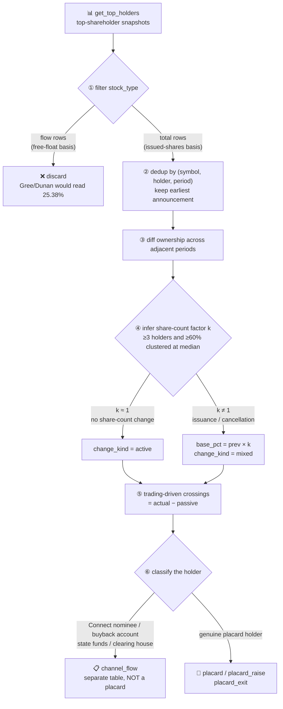

# 🚩 Equity Placard Watchlist

[简体中文](README.md) | **English**

> When someone buys past **5%** of a listed company, Chinese securities law forces them to raise their hand
> in public — that is a **placard** (举牌).
> This tool reconstructs those hand-raises from top-shareholder snapshots and answers
> **who is buying in, how many rungs up they have climbed, and whether they want a trade or a board seat**.
> **Report-period snapshot basis, not a real-time placard feed; not investment advice.**

> Project status: QUANTSKILLS **Community Project** — not reviewed, certified or endorsed by QuantSkills. Task ID `#17`.

<p align="center">
  
  
  
  
  
  
  
  
</p>

---

## 📖 What this is

Chinese securities law requires an investor holding **5% of a listed company's issued shares** to file a
public disclosure — the "placard" — and to file again on every further 5% bought or sold. It is one of the
most informative shareholder signals in the A-share market: **someone cared enough about control or influence
to buy to the point of having to identify themselves.**

This skill tracks each shareholder's ownership time series and detects crossings of the statutory thresholds:

| Event | Meaning | In plain terms |
|---|---|---|
| 🟢 **First placard** | crosses up through 5% | a new player has arrived and must identify themselves |
| 🔵 **Raising** | crosses up through 10 / 15 / 20 / 25 / 30% | the higher the rungs, the more serious; 30% is the control watershed |
| 🔴 **Exit** | drops below any threshold | a previous placard position is unwinding |
| 🟡 **Approaching** | at 4.x%, within 1pt of a line | one more purchase and they must file — watch them now |

Every event carries an **intent leaning** (financial vs strategic), the **six-month short-swing-profit lock-up**,
and a plain-language verdict.

---

## 🧭 Processing pipeline



---

## ⚠️ Two calibration traps you must know

These two corrections are the core value of this skill — on a live market-wide run they remove **17.9% of events as false**.

### ① The `stock_type` dual basis: pick the wrong rows and every rung is wrong

`get_top_holders` returns both `total` (top shareholders) and `flow` (top tradable-share holders).
**The `flow` rows carry a `hold_percent_total` column of the same name whose value is computed on the free float.**

| stock_type | Gree Electric in Dunan Env. @20241231 | Public fact |
|---|---|---|
| `flow` | 25.38% ❌ | ~38% |
| `total` | **38.46%** ✅ | ~38% |

Placards are measured on **issued shares**, so only `total` rows may be used.

### ② Passive dilution: an issuance is not a sale

When a company issues new shares the pie grows — **nobody sold, yet everyone's percentage falls.** Live examples:

```
301629.SZ @20250324   seven holders "drop" simultaneously
  He Qinxiu / Yang Bo / Wang Shengli / Hu Hong / Gu Guowen   12.2198% → 9.1648%   ratio 0.75000
  Shenzhen Xibo No.1                                          6.0610% → 4.5457%   ratio 0.75000
  Ningbo Meishan Fengnian Junhe                               5.4849% → 4.1137%   ratio 0.75001
                                                                    ↑ all 0.75 = one third of new shares issued
```

`600358.SH` is starker: six holders all at ratio **0.4341** (share issuance to acquire assets, share count up 2.3×).
Its "Jiangxi Tourism Group 19.57% → 8.49%" would be reported as a **massive sell-down** — not a single share was sold.

**Correction**: per (symbol, period) take the median ratio as `k` (requires ≥3 holders and ≥60% clustered within ±1%),
set `base_pct = prev_pct × k` — the percentage one would hold having traded nothing — and compute
**crossings = actual crossings − passive crossings**.

> **The reverse matters just as much**: cancelling repurchased shares shrinks the share count and pushes everyone
> passively above 5% — **that is not a placard** (nobody bought a share).

---

## 🎭 Channel accounts: the largest source of false positives

Left untreated, the most frequent "crosses 5%" entity is **Hong Kong Securities Clearing Company** —
the **nominee holder for Stock Connect**, standing in for thousands of offshore investors.
**No one filed any disclosure.**

This skill excludes them by default but keeps them in a separate `channel_flow` table rather than discarding —
northbound holdings crossing 5% is a genuine flow signal, it simply is not a placard.

| Class | Identified by | Handling |
|---|---|---|
| Connect nominee | Hong Kong Securities Clearing | → `channel_flow` |
| Buyback account | dedicated repurchase account | → `channel_flow` |
| State funds | China Securities Finance / Central Huijin | → `channel_flow` |
| Clearing / registry | China Securities Depository and Clearing | → `channel_flow` |
| **Genuine placard holder** | everything else | → `placard_event` ✅ |

---

## 🚀 Quick start

```bash
pip install --upgrade panda_data pyarrow
export PANDA_USERNAME=<phone>; export PANDA_PASSWORD=<password>   # or ~/.pandadata/pandadata.env

# Market-wide scan + persist + dashboard (measured: 550k rows / 63s)
python 开发产物/scripts/build.py --mode scan --start 20250101 --end 20260721 --save --html board.html
# Single / multiple symbols
python 开发产物/scripts/build.py --symbols 601005.SH 002011.SZ --start 20240101 --end 20260721
# Fully offline self-test (green without panda_data)
python 开发产物/scripts/test.py
```

Real cases found in a live run:

```
[20260624] 601005.SH Huabao Investment      1.55% → 9.31%   first placard (Baowu group takes 9.3% at once)
[20260613] 601113.SH Zhen'ai Group          9.72% → 26.39%  raising · strategic leaning
[20260421] 002825.SZ Zhang Jianliang        4.88% → 5.00%   first placard (right on the line)
```

---

## 📂 Layout

```
开发产物/  (development)
  scripts/
    placard.py     core logic (pure, zero IO: threshold crossings + share-count correction + intent + lock-up)
    datasource.py  PandaData → standard panel (total-basis filter + holder classification)
    build.py       run / validate_input / scan+watchlist / BUILD §11 parquet
    render.py      markdown dossier + dark HTML dashboard (explicit truncation notices, never silent)
    test.py        fully offline synthetic fixtures (22 cases)
  references/
    api_guide.md         interface fields + live-tested findings
    quality_evidence.md  false-positive reproduction → fix → regression record
  SKILL.md / skill.json
生产产物/  (production)
  database.parquet              result panel (bundled sample: 5,734 rows / 1,345 symbols / 20250107–20260716)
  sample_placard_dashboard.html dashboard sample
  SKILL.md                      production read rules
```

---

## ⚖️ Data & disclaimer

**Source**: PandaData `get_top_holders` (credentials via env vars or `~/.pandadata/pandadata.env`, **never hard-coded**).

> The interface named in the original task spec, `get_stock_equity_placard`, **does not exist** in the latest
> PandaData interface documentation (187 methods) — which contains no mention of placards, equity-change filings
> or concert parties either — so events are reconstructed from top-shareholder snapshots instead.

**Known limitations (must be stated honestly)**:

1. **Report-period snapshot basis** — only period cross-sections are visible; **a placard opened and unwound
   between periods is invisible**. This is not a real-time feed.
2. **Concert parties cannot be aggregated** — the data has no such field, so several affiliates each holding 4%
   and jointly exceeding 5% will not be detected.
3. **Top-ten shareholders only** — a 5% stake almost always makes the top ten, but a blind spot exists in theory.
4. **Intent is a leaning, not a verdict** — the data has no "purpose of the placard" field; `intent` is a prior
   derived from holder type, stake size and buying intensity.
5. **Share-count correction needs ≥3 holders** — small groups are left uncorrected; better not to adjust than to adjust wrongly.

> **Community Project, not reviewed / certified / endorsed by QuantSkills. Research and educational example only;
> not investment advice, no return promises.** A placard does not imply the stock will rise.

License: **GPL-3.0-only**
