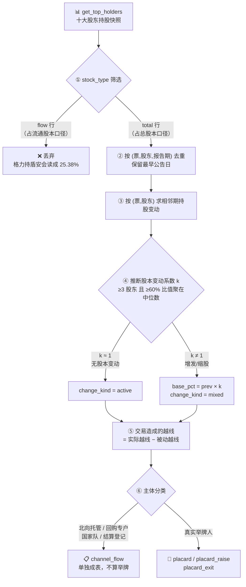

# 🚩 举牌行为监控

**简体中文** | [English](README.en.md)

> 单一股东持股达到 **5%** 时，《证券法》要求其公开披露身份与持股——这就是**举牌**。
> 本工具从十大股东快照重建这些"举手"事件，回答**谁在举、举到第几档、是想赚差价还是想进董事会**。
> **口径：报告期快照重建，非实时举牌播报。**

> 项目状态：QUANTSKILLS **社区项目（Community Project）**，未经官方审核 / 认证 / 背书。任务编号 `#17`。

<p align="center">
  
  
  
  
  
  
  
  
</p>

---

## 📖 这是什么

《证券法》规定：投资者持有上市公司**已发行股份 5%** 时须公告（"举牌"），此后每增减 5% 再公告一次。
这是 A 股最有信息量的股东行为信号之一——**有人愿意为了控制权/话语权买到必须实名的程度**。

本 skill 跟踪每个股东的持股比例时间序列，检出上穿 / 跌破法定梯度线的事件：

| 事件 | 含义 | 人话 |
|---|---|---|
| 🟢 **首次举牌** | 上穿 5% | 新的重要股东进场，触发强制披露 |
| 🔵 **继续加码** | 上穿 10 / 15 / 20 / 25 / 30% | 档位越高越接近谋求控制权；30% 是分水岭 |
| 🔴 **减持跌破** | 向下跌破任一梯度线 | 此前的举牌头寸在退出 |
| 🟡 **逼近观察** | 已到 4.x%，距线 ≤1pt | 再增持少量即触发披露，提前跟踪 |

每起事件配**意图倾向**（财务 vs 战略）、**6 个月短线交易归入权锁定期**，以及一段简明研判。

---

## 🧭 处理流水线



---

## ⚠️ 两个必须知道的口径陷阱

这两项是本 skill 的核心价值——真机全市场实测共剔除 **17.9% 的假事件**。

### ① `stock_type` 双口径：用错行整个梯度全错

`get_top_holders` 同时返回 `total`（十大股东）与 `flow`（十大流通股东）两套行，
**`flow` 行的 `hold_percent_total` 字段名虽同，值却是在流通股本上算的**。

| stock_type | 格力电器持盾安环境 @20241231 | 公开事实 |
|---|---|---|
| `flow` | 25.38% ❌ | ~38% |
| `total` | **38.46%** ✅ | ~38% |

举牌按**已发行股份**算，必须只取 `total`。

### ② 股本变动被动稀释：增发 ≠ 减持

公司增发新股后总股本增加，**未交易股东的持股比例同步下降**。真机实测：

```
301629.SZ @20250324   七个股东同时"跌破"
  何沁修 / 杨波 / 王胜利 / 胡泓 / 辜国文   12.2198% → 9.1648%   比值 0.75000
  深圳西博壹号                              6.0610% → 4.5457%   比值 0.75000
  宁波梅山丰年君和                          5.4849% → 4.1137%   比值 0.75001
                                                        ↑ 全是 0.75 = 发行 1/3 新股
```

`600358.SH` 更极端：六个股东比值全是 **0.4341**（发行股份购买资产，总股本涨到 2.3 倍），
其中"江西省旅游集团 19.57%→8.49%"若不处理会被报成**特大减持**——实际一股没卖。

**处理**：按 (票, 报告期) 取比值中位数为 `k`（需 ≥3 个股东且 ≥60% 聚在 ±1% 内才敢认定），
`base_pct = prev_pct × k` 即"完全不交易应有的比例"，**越线判定 = 实际越线 − 被动越线**。

> **反向同样危险**：回购注销使总股本缩小，所有人被动升破 5%——**那不是举牌**（没人买过一股）。

---

## 🎭 通道账户：最大的假阳性源

未处理时，"上穿 5%"事件里最高频的主体是 **「香港中央结算有限公司」**——
那是沪深股通的**名义持有人（北向托管）**，背后是成千上万境外投资者，**没有任何人交过权益变动报告书**。

本 skill 默认剔除，但**单独成 `channel_flow` 表不丢弃**——北向持股穿越 5% 本身是有信息量的资金信号，只是不叫举牌。

| 类别 | 识别 | 处理 |
|---|---|---|
| 北向托管 | 香港中央结算有限公司 | → `channel_flow` |
| 回购专户 | 回购专用证券账户 | → `channel_flow` |
| 国家队 | 证金公司 / 中央汇金 | → `channel_flow` |
| 结算登记 | 中国证券登记结算 | → `channel_flow` |
| **真实举牌人** | 其余 | → `placard_event` ✅ |

---

## 🚀 快速开始

```bash
pip install --upgrade panda_data pyarrow
export PANDA_USERNAME=<手机号>; export PANDA_PASSWORD=<密码>   # 或 ~/.pandadata/pandadata.env

# 全市场扫描 + 落盘 + 出看板（实测 55 万行 / 63 秒）
python 开发产物/scripts/build.py --mode scan --start 20250101 --end 20260721 --save --html board.html
# 单票 / 多票
python 开发产物/scripts/build.py --symbols 601005.SH 002011.SZ --start 20240101 --end 20260721
# 全离线自测（无 panda_data 也全绿）
python 开发产物/scripts/test.py
```

真机扫出的例子：

```
[20260624] 601005.SH 华宝投资有限公司   1.55% → 9.31%   首次举牌（宝武系一举加到 9.3%）
[20260613] 601113.SH 真爱集团有限公司   9.72% → 26.39%  继续加码 · 战略倾向
[20260421] 002825.SZ 章建良            4.88% → 5.00%   首次举牌（踩线举牌）
```

---

## 📂 目录

```
开发产物/
  scripts/
    placard.py     核心逻辑（纯逻辑零 IO：梯度穿越 + 股本变动校正 + 意图画像 + 锁定期）
    datasource.py  PandaData → 标准面板（total 口径过滤 + 主体分类）
    build.py       run / validate_input / scan+watchlist / BUILD §11 parquet
    render.py      markdown 档案 + 暗色 HTML 看板（超量显式声明，不静默截断）
    test.py        全离线合成夹具（22 用例）
  references/
    api_guide.md         接口字段 + 真机实测结论
    quality_evidence.md  假阳性复现 → 修复 → 回归记录
  SKILL.md / skill.json
生产产物/
  database.parquet              结果面板（随包样例：5734 行 / 1345 只 / 20250107~20260716）
  sample_placard_dashboard.html 看板样本
  SKILL.md                      生产结果读取规则
```

---

## ⚖️ 数据与免责

**数据源**：PandaData `get_top_holders`（凭证走环境变量或 `~/.pandadata/pandadata.env`，**绝不硬编码**）。

> 任务清单点名的 `get_stock_equity_placard` 在 PandaData 最新接口文档（187 方法）中**不存在**，
> 文档里连"举牌 / 权益变动 / 一致行动"字样都没有，故改用十大股东快照重建。

**已知限制（必须如实转达）**：

1. **报告期快照口径** —— 只能看到报告期截面，**报告期之间发生并回撤的举牌看不到**；非实时播报。
2. **一致行动人无法合并** —— 数据无该字段，多个关联方各持 4% 合计超 5% 的情形检测不到。
3. **仅十大股东** —— 5% 几乎必进前十，但理论上存在榜外盲区。
4. **意图为倾向判断** —— 数据无"举牌目的"字段，`intent` 仅依据主体性质 / 持股高度 / 增持力度给先验，**非定论**。
5. **股本变动校正需 ≥3 个股东** —— 小样本组合不做校正，宁可不调也不乱调。

> **Community Project，未经 QuantSkills 官方审核 / 认证 / 背书。仅量化研究与教育示例，
> 不构成投资建议，不承诺收益。** 举牌事件不代表标的会涨。

License: **GPL-3.0-only**
